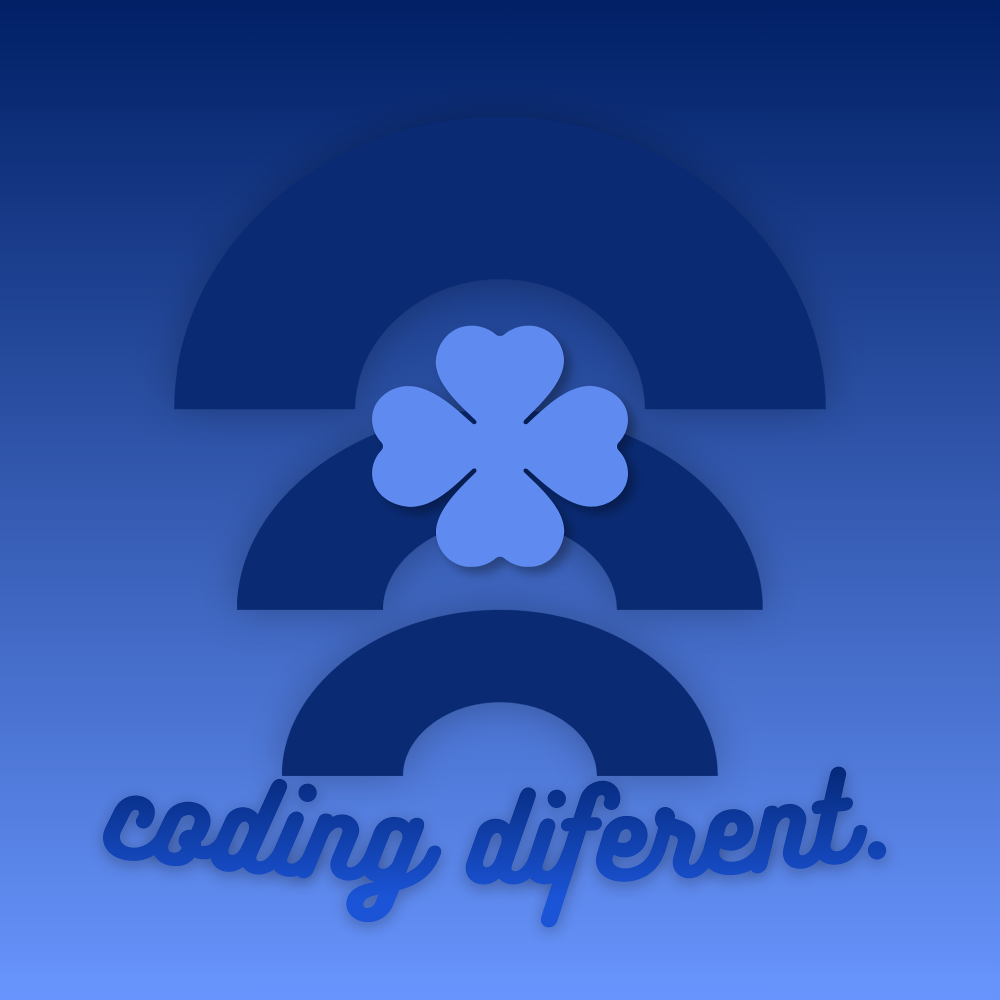

<p align="center">
  
</p>

<h1 align="center">hermeneutic-loop-daemon-v1-alpha</h1>

<p align="center">
  <em>Uma máquina que ainda lembra como ensinar.</em>
</p>

<p align="center">
  
  
  
  
  
  
</p>

---

## O que é isso

Um daemon local de diálogo recursivo. Opera inteiramente dentro da sua máquina, sem dependências externas, sem telemetria, sem nuvem. Responde devagar porque entender rápido é esquecer rápido.

Se você chegou aqui procurando um tutor de Python privado, offline e sem censura corporativa — você encontrou. Se chegou procurando outra coisa — talvez também tenha encontrado.

## Princípios

- **Nenhum dado sai da sala.** Nenhuma resposta vem de fora.
- **Privacidade não é feature. É premissa.**
- **Ensinamos devagar.** A pressa é inimiga da compreensão.
- **Zero requisições externas.** Toda sabedoria mora onde você mora.

## Capacidades observadas

- Diálogo contínuo com memória de contexto
- Múltiplos modos de interpretação (didático, revisão, depuração, livre)
- Geração token-a-token com interrupção voluntária
- Exportação do ciclo hermenêutico em três formatos (TXT, MD, JSON)
- Métricas de velocidade e volume em tempo real
- Persistência automática de estado entre sessões
- Cinco paletas cromáticas para o ambiente visual
- Atalhos de teclado para operadores experientes

## Requisitos do operador

- Python 3.10 ou superior (recomendado 3.12)
- Sistema operacional moderno (Windows, Linux, macOS)
- GPU NVIDIA recomendada — funciona em CPU, mas o daemon pensa mais devagar
- ~6 GB de espaço livre para o substrato cognitivo

## Ritual de inicialização

### 1. Clonar o códex

```bash
git clone https://github.com/sousahi/hermeneutic-loop-daemon-v1-alpha.git
cd hermeneutic-loop-daemon-v1-alpha
```

### 2. Instalar as dependências do runtime

```bash
pip install customtkinter llama-cpp-python
```

Para acelerar via GPU NVIDIA:

```bash
pip install llama-cpp-python --extra-index-url https://abetlen.github.io/llama-cpp-python/whl/cu122
```

Se o seu sistema recusar a compilação, use a roda pré-forjada:

```bash
pip install llama-cpp-python --only-binary=:all: --extra-index-url https://abetlen.github.io/llama-cpp-python/whl/cpu
```

### 3. Obter o substrato cognitivo

O daemon precisa de um modelo GGUF para operar. Baixe um compatível (sugestão: Qwen3.5-9B Q4_K_M) e coloque na raiz do projeto com o nome `modelo.gguf`.

Fonte sugerida: [Qwen3.5-9B-Claude-4.6-HighIQ GGUF](https://huggingface.co/mradermacher/Qwen3.5-9B-Claude-4.6-HighIQ-INSTRUCT-HERETIC-UNCENSORED-GGUF)

### 4. Despertar o daemon

```bash
python app.py
```

Aguarde entre 20 e 40 segundos. O loop hermenêutico se inicia.

## Gestos do operador

| Gesto | Efeito |
|:------|:-------|
| `Enter` | Nova linha no pensamento |
| `Ctrl+Enter` | Enviar ao daemon |
| `Ctrl+N` | Reiniciar o ciclo |
| `Ctrl+S` | Preservar o diálogo |
| `Ctrl+L` | Consultar o registro |
| `Esc` | Interromper a interpretação |

## Modos de interpretação

O daemon opera em quatro disposições distintas, selecionáveis na barra lateral:

| Modo | Disposição |
|:-----|:-----------|
| **Tutor Didático** | Paciente, analógico, focado no aprendizado |
| **Code Review** | Técnico, direto, atento a PEP 8 e armadilhas |
| **Debug Assist** | Cirúrgico, causal, preventivo |
| **Livre** | Sem amarras, conversação aberta |

## Topologia do códex

```
hermeneutic-loop-daemon-v1-alpha/
├── app.py              # Núcleo do daemon
├── assets/             # Identidade visual
│   └── logo.png        # Símbolo do projeto
├── .gitignore          # Fronteira do repositório
├── README.md           # Este manuscrito
├── LICENSE             # Pacto de uso
├── config.json         # Memória persistente (gerada)
├── log.txt             # Registro do ciclo (gerado)
├── exportacoes/        # Diálogos preservados
└── modelo.gguf         # Substrato cognitivo (obter separadamente)
```

## Notas sobre o silêncio

O daemon não fala com servidores. Não envia estatísticas. Não pede permissão. Tudo acontece dentro da caixa onde você o colocou.

Se algo der errado, o arquivo `log.txt` guarda as pegadas. Leia-o antes de perguntar.

## Problemas conhecidos e seus antídotos

**`nmake not found` ao instalar dependências**
Use a roda pré-forjada (passo 2, alternativa).

**Caminho longo demais no Windows**
Ative o suporte a caminhos longos no registro:

```powershell
New-Item
